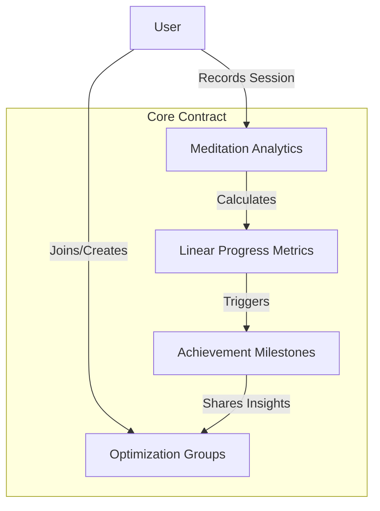

# Linear DApp Solver: Meditation Progress Tracking

A blockchain-powered solution for linear optimization of meditation practices through digital achievements and community engagement.

## Overview

Linear DApp Solver is an innovative digital platform designed for meditation practitioners to:
- Quantify and analyze meditation sessions
- Achieve linear progression through structured milestones
- Optimize practice through data-driven insights
- Build a transparent, verifiable record of mindfulness development

Our platform transforms meditation into a measurable, trackable journey of personal growth and community support.

## Architecture

The system leverages a core smart contract to manage:
- Precise meditation session tracking
- Linear achievement progression
- Group dynamics and collaborative learning
- Comprehensive statistical analysis



## Contract Documentation

### Core Contract (meditation-solver.clar)

The main contract managing Linear DApp Solver's meditation optimization framework.

#### Key Features
- Precision meditation session recording
- Linear achievement tracking
- Group performance analysis
- Comprehensive user progression metrics

#### Achievement Progression Models
1. Session Count Optimization
2. Consistent Practice Streaks
3. Cumulative Duration Analysis
4. Practice Diversity Scoring

#### Meditation Exploration Types
- Mindfulness Calibration
- Focused Intent
- Compassion Engineering
- Somatic Awareness
- Transcendental Mapping

## Getting Started

### Prerequisites
- Clarinet
- Stacks-compatible wallet

### Basic Usage

1. Record a meditation session:
```clarity
(contract-call? .meditation-solver record-meditation-session 
    u30  ;; duration in minutes
    u1   ;; meditation type (1 = mindfulness)
    none ;; optional analytical notes
)
```

2. Create an optimization group:
```clarity
(contract-call? .meditation-solver create-meditation-group 
    "Linear Mindfulness Collective" 
    "A group dedicated to systematic meditation optimization"
)
```

## Function Reference

### Public Functions

#### record-meditation-session
```clarity
(define-public (record-meditation-session 
    (duration uint) 
    (meditation-type uint) 
    (notes (optional (string-utf8 256)))
)
```
Records a meditation session and triggers linear progression analysis.

#### create-meditation-group
```clarity
(define-public (create-meditation-group 
    (name (string-utf8 64)) 
    (description (string-utf8 256))
)
```
Establishes a new collaborative meditation optimization group.

### Read-Only Functions

#### get-user-progression
```clarity
(define-read-only (get-user-stats (user principal))
```
Retrieves comprehensive meditation progression metrics.

## Development

### Testing
```bash
clarinet test
```

### Local Development
```bash
clarinet console
```

## Security Considerations

### System Constraints
- Group membership: 100 members
- Achievement tracking: 100 milestones
- Meditation type diversity: 10 unique approaches

### Optimization Best Practices
- Validate achievement authenticity
- Verify group membership
- Maintain input precision
- Consider temporal variations in practice